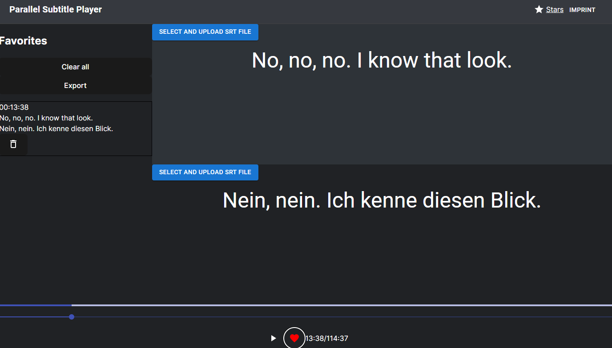

# ParallelSubtitlePlayer

## Overview

ParallelSubtitlePlayer is a web application designed to enhance language learning through synchronized playback of original and translated subtitles. The platform enables users to select two sets of subtitles, facilitating a side-by-side comparison for an immersive language learning experience. Additionally, users can favorite and export original texts and translations, creating a personalized language study environment.

## Features

- **Dual Subtitle Synchronization:** Simultaneous display of original and translated subtitles for effective language comparison.
  
- **Personalized Learning:** Favorite and export functionalities allow users to curate and export content for focused language study.

- **Intuitive Interface:** A user-friendly interface that makes language learning an enjoyable and seamless process.

## Getting Started

You can just access it with this URL: 

## Contributing

We welcome contributions! If you would like to contribute to ParallelSubtitlePlayer, please follow our [contribution guidelines](CONTRIBUTE.md).

## License

This project is licensed under the GNUv3 License - see the [LICENSE](LICENSE) file for details.

---

**Happy learning! 🌐📚**
